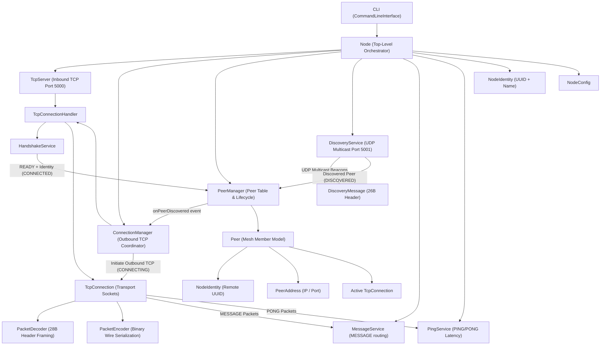

# MeshDrop Architecture Specification

## 1. Overview
MeshDrop is a peer-to-peer (P2P) local area network (LAN) communication and high-speed file transfer system built from scratch in Java 26 without external frameworks.

## 2. Architectural Hierarchy



```text
                    CLI
                     │
                     ▼
                    Node
                     │
       ┌─────────────┼──────────────┐
       ▼             ▼              ▼
 PeerManager   ConnectionManager  Discovery
       │             │
       └───────┬─────┘
               ▼
         TcpConnection
               │
          Protocol Layer
```

## 3. Subsystem Breakdown

### 3.1 CLI Subsystem (`com.meshdrop.cli`)
- **`CommandLineInterface`**: Interactive console loop reading from `System.in`, parsing commands, executing actions via `Node`, and rendering results.
- **`CommandParser`**: Tokenizes input with support for quotes (`"hello world"`) and rest-of-line string arguments (`send abc message with spaces`).
- **`Command`**: Immutable value record capturing command name and arguments.
- **`CommandResult`**: Result carrier holding success status and output message.

### 3.2 Message & Latency Subsystem (`com.meshdrop.message`)
- **`MessageService`**: Application-level text message exchange. Sends `MESSAGE` packets over active `TcpConnection` and dispatches incoming messages to `MessageListener` callbacks.
- **`MessageListener`**: Functional interface invoked upon receiving verified messages from remote peers.
- **`PingService`**: Asynchronous latency measurement. Transmits `PING` frames with tracked `requestId` and resolves `CompletableFuture<Long>` upon arrival of matching `PONG` responses.

### 3.3 Core Subsystem (`com.meshdrop.core`)
- **`Node`**: Top-level lifecycle orchestrator. Initializes subsystems, coordinates startup, and manages graceful shutdown.
- **`NodeConfig`**: Immutable configuration properties (TCP port, UDP port, chunk size, handshake timeout, connection timeout, buffer sizes).
- **`NodeIdentity`**: Persistent identity mechanism (`UUID`, display name `MeshDrop-XXXX`). Provides binary serialization for `HELLO` handshakes.
- **`NodeState`**: Lifecycle state tracker (`INITIALIZING`, `RUNNING`, `SHUTTING_DOWN`, `STOPPED`).

### 3.4 Connection Subsystem (`com.meshdrop.connection`)
- **`ConnectionManager`**: Orchestrates outgoing TCP connection attempts to discovered peers. Manages in-flight attempt deduplication (preventing connection storms), enforces connection timeouts, executes identity mismatch checks, and registers established connections.
- **`ConnectionAttempt`**: Tracks active in-flight connection attempts and associated socket lifecycles.

### 3.5 Network Subsystem (`com.meshdrop.network`)
- **`TcpServer`**: Listens on `java.net.ServerSocket`, accepts incoming connections, wraps each in a `TcpConnection`, and dispatches to `TcpConnectionHandler` on a virtual thread.
- **`TcpConnection`**: Manages bidirectional byte-stream communication with a single remote endpoint. Wraps `java.net.Socket` with buffered I/O, `ConnectionDirection` (`INBOUND` / `OUTBOUND`), close listeners, state guards, and packet I/O synchronization.
- **`TcpConnectionHandler`**: Application-level connection initialiser. Starts the receiver loop and delegates peer handshakes to `HandshakeService`.
- **`ConnectionState`**: Connection lifecycle states: `CONNECTING` → `CONNECTED` → `HANDSHAKING` → `READY` → `CLOSING` → `CLOSED`.
- **`ConnectionDirection`**: Transport direction metadata: `INBOUND` (accepted) vs `OUTBOUND` (initiated).

### 3.6 Peer Subsystem (`com.meshdrop.peer`)
- **`Peer`**: Model representing a remote MeshDrop node. Contains authoritative `NodeIdentity`, dynamic `PeerAddress`, `PeerState`, and active `TcpConnection`.
- **`PeerState`**: Peer lifecycle states: `DISCOVERED` → `CONNECTING` → `CONNECTED` → `DISCONNECTED`.
- **`PeerAddress`**: Immutable value record storing host IP string and TCP port.
- **`PeerManager`**: Thread-safe registry and lifecycle coordinator for all peers. Handles discovery registration, handshake promotion to `CONNECTED`, automated disconnect handling, and deterministic duplicate connection deduplication (using 128-bit unsigned UUID ordering). Supports flexible peer lookup via `findPeersByIdentifier(String)`.
- **`PeerListener`**: Event callback interface for peer discovery, connection, and disconnection events.

### 3.7 Protocol Subsystem (`com.meshdrop.protocol`)
- **`HandshakeService`**: Orchestrates `HELLO`/`HELLO_RESPONSE` identity negotiation, self-connection detection, handshake timeouts, and `READY` transitions.
- **`Packet`**: Immutable representation of an application protocol message with 28-byte header + payload.
- **`PacketEncoder`**: Serializes `Packet` objects into binary byte streams using big-endian network byte order.
- **`PacketDecoder`**: Stream-based decoder handling packet boundaries, stream fragmentation, and malformed frames.
- **`PacketType`**: Enum representing message types (`HELLO`, `HELLO_RESPONSE`, `PING`, `PONG`, `MESSAGE`, etc.) with numeric wire codes.
- **`ProtocolConstants`**: Magic bytes (`0x4D445250` / `"MDRP"`), protocol version (`0x01`), max payload size (`16 MiB`), max display name length (`128 bytes`), default handshake timeout (`10,000 ms`).
- **`ProtocolException`**: Protocol violations, invalid magic bytes, excessive size limits, truncated streams, self-connections.

### 3.8 Discovery Subsystem (`com.meshdrop.discovery`)
- **`DiscoveryService`**: Coordinates UDP multicast socket lifecycle, multi-interface multicast group joining, periodic daemon beacon broadcasts, and virtual-thread receiver loop.
- **`DiscoveryMessage`**: Immutable record representing a 26+N byte big-endian discovery beacon frame (`MAGIC` + `VERSION` + `TYPE` + `NODE ID` + `TCP PORT` + `NAME LENGTH` + `DISPLAY NAME`).
- **`DiscoveryConstants`**: Default multicast group (`239.255.77.80`), UDP discovery port (`5001`), broadcast interval (`5000 ms`), max discovery packet size (`512 bytes`).
- **`DiscoveryListener`**: Callback interface for reporting discovered peers to `Node` and `PeerManager`.

### 3.9 File Transfer Subsystem (`com.meshdrop.transfer`)
- **`FileTransferService`**: High-level coordinator managing inbound and outbound file transfers. Translates application offers, chunk streaming, resume negotiation, and hash verification into binary wire packets.
- **`TransferManager`**: In-memory registry tracking all active, completed, resumable, and failed `Transfer` instances. Emits lifecycle events to `TransferListener` subscribers.
- **`Transfer`**: Observable transfer model tracking transfer ID, direction (`OUTBOUND` / `INBOUND`), peer ID, file metadata, byte progression, progress percentages, and states.
- **`ChunkManager`**: Manages fixed-size chunk partitioning (default 64 KiB), random access I/O, partial file writing, and rolling digest calculations.
- **`TransferCheckpoint`**: Metadata tracking persisted bytes and chunk progress for resumable transfers. Persisted to disk atomically via `.meta` companion files.
- **`ResumeManager`**: Orchestrates resume offer evaluation, file size/hash verification, receiver-authoritative chunk boundary alignment, and upload seek resumption.

### 3.10 Security & Trust Subsystem (`com.meshdrop.security`)
- **`CryptoUtils`**: Standard Java 26 Ed25519 asymmetric cryptography helper (`KeyPairGenerator`, `KeyFactory`, `Signature`). Handles keypair generation, X.509 / PKCS#8 serialization, and digital signing/verification.
- **`IdentityFingerprint`**: Generates and formats human-verifiable 32-character uppercase hex fingerprints (`AB12-CD34-EF56-7890-...`) derived from the SHA-256 digest of Ed25519 public keys.
- **`TrustStore`**: Disk-backed atomic manager persisting peer trust states (`TRUSTED`, `UNTRUSTED`, `BLOCKED`) to `<dataDir>/trust/trust_store.txt`. Detects MITM fingerprint changes and blacklists rogue nodes.
- **`IdentityStorage`**: Persists local node cryptographic identity to `<dataDir>/identity/node_identity.properties` with file permission protection.

### 3.11 Storage & Isolation Subsystem (`com.meshdrop.storage`)
- **`StorageManager`**: Encapsulates disk layouts (`downloads/`, `transfers/`, `identity/`, `trust/`, `logs/`). Provides `resolveSafeDownloadPath` ensuring all downloads remain strictly sandboxed and rejecting path traversal or absolute injection attacks.
