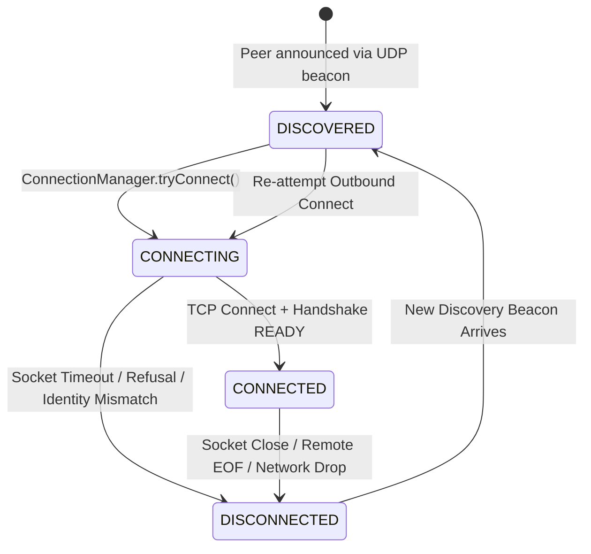

# MeshDrop Connection Management Specification

## 1. Overview & Purpose
In MeshDrop, **`ConnectionManager`** is responsible for establishing outbound TCP connections to discovered peers and driving them through the application handshake to become active, verified members of the mesh.

### Architectural Separation of Concerns:
- **`DiscoveryService`**: *"Who is available on the LAN?"* (Broadcasts/receives UDP multicast beacons; notifies `PeerManager`).
- **`PeerManager`**: *"What peers do I currently know?"* (Maintains peer table, address history, and resolves duplicate connections).
- **`ConnectionManager`**: *"Should I establish an outbound TCP connection to this peer?"* (Controls connection policy, attempt deduplication, timeouts, and identity mismatch validation).
- **`TcpConnection`**: *"How do I communicate over TCP?"* (Encapsulates socket byte-streams, framing, and transport states).
- **`HandshakeService`**: *"Who is this remote node?"* (Negotiates `HELLO`/`HELLO_RESPONSE` identity authentication).
- **`Node`**: Orchestrates lifecycle and wires all subsystems together.

> [!IMPORTANT]
> **Discovery != Connection**: `DiscoveryService` never opens TCP sockets directly. Discovering a peer over UDP marks it `PeerState.DISCOVERED`. `ConnectionManager` evaluates the discovered peer and initiates an outgoing TCP connection if eligible.

---

## 2. End-to-End Discovery → TCP Connection → Handshake Pipeline

```text
Node A                                      LAN (UDP / TCP)                                     Node B
  │                                                │                                               │
  ├────── UDP Discovery Beacon ───────────────────►│                                               │
  │       (Node ID, TCP Port, Name)                ├────── Datagram Received ─────────────────────►│
  │                                                │                                               │
  │                                                │       DiscoveryService.receiveLoop()          │
  │                                                │               │                               │
  │                                                │               ▼                               │
  │                                                │       PeerManager.registerDiscovered()        │
  │                                                │       (PeerState.DISCOVERED)                  │
  │                                                │               │                               │
  │                                                │               ▼                               │
  │                                                │       ConnectionManager.tryConnect()          │
  │                                                │       (PeerState.CONNECTING)                  │
  │                                                │               │                               │
  │                                                │               ▼                               │
  │                                                │       Virtual Thread: Socket.connect()        │
  │◄──────────────────────── TCP 3-Way Handshake ──┴───────────────────────────────────────────────┤ (TCP Port B)
  │                                                                                                │
  │       TcpServer.accept() [INBOUND]                             TcpConnection [OUTBOUND]        │
  │               │                                                        │                       │
  │               ▼                                                        ▼                       │
  │       HandshakeService.initiateHandshake()                     HandshakeService.initiate()     │
  │               │                                                        │                       │
  │◄────── HELLO (Identity B) ─────────────────────────────────────────────┤                       │
  ├─────── HELLO (Identity A) ────────────────────────────────────────────►│                       │
  ├─────── HELLO_RESPONSE (Identity A) ───────────────────────────────────►│                       │
  │◄────── HELLO_RESPONSE (Identity B) ────────────────────────────────────┤                       │
  │                                                                        │                       │
  │       ConnectionState.READY                                    ConnectionState.READY           │
  │               │                                                        │                       │
  │               ▼                                                        ▼                       │
  │       PeerManager.registerConnected()                          PeerManager.registerConnected() │
  │       (PeerState.CONNECTED)                                    (PeerState.CONNECTED)           │
  │                                                                                                │
  │◄══════════════════════ Mutual Bidirectional Protocol Packets (MESSAGE / PING) ════════════════►│
```

---

## 3. Outgoing Connection Lifecycle & State Transitions



### Transition Steps:
1. **`DISCOVERED`**: Peer announced via UDP discovery beacon.
2. **`CONNECTING`**: `ConnectionManager.tryConnect()` initiates a background connection attempt on a dedicated Java 26 virtual thread.
3. **`CONNECTED`**: TCP socket connects, `HandshakeService` completes mutual `HELLO`/`HELLO_RESPONSE` exchange, remote identity is authenticated, and `PeerManager` promotes peer to `CONNECTED`.
4. **`DISCONNECTED`**: Transport connection terminates or connection attempt fails. The `Peer` record remains in `PeerManager` for future reconnection.

---

## 4. Connection Attempt Deduplication & Storm Prevention

Discovery beacons are broadcast periodically (e.g. every 5 seconds). During high-frequency bursts or network packet replication, dozens of beacons may arrive in rapid succession.

To prevent connection storms:
- `ConnectionManager` maintains an in-flight connection map:
  ```java
  ConcurrentHashMap<UUID, ConnectionAttempt> inFlightAttempts;
  ```
- Before attempting a connection, `inFlightAttempts.putIfAbsent(targetNodeId, attempt)` ensures that **at most one outgoing connection attempt per remote Node ID** can be in-flight at any instant.
- If a peer is already in `PeerState.CONNECTING` or `PeerState.CONNECTED` (or `peer.isConnected() == true`), subsequent discovery beacons are ignored immediately without initiating parallel sockets.
- Upon completion, failure, timeout, or shutdown, the attempt is removed from `inFlightAttempts`.

---

## 5. TCP Connection Timeout

Socket connection attempts must never block indefinitely.
- Configured via `NodeConfig.connectionTimeoutMillis` (default `5000 ms`).
- Uses standard Java non-blocking connect:
  ```java
  Socket socket = new Socket();
  socket.setTcpNoDelay(true);
  socket.setKeepAlive(true);
  socket.connect(new InetSocketAddress(host, port), config.connectionTimeoutMillis());
  ```
- If the timeout expires (`SocketTimeoutException`) or the connection is refused (`ConnectException`), the attempt is aborted, the socket closed, the attempt removed from `inFlightAttempts`, and the peer transitioned to `PeerState.DISCONNECTED`.

---

## 6. Authoritative Handshake Identity vs Discovery Hints (Anti-Spoofing)

Discovery packets are unauthenticated UDP frames and treated as untrusted hints:
- A malicious or misconfigured node might broadcast a beacon claiming Node ID `AAA` while listening at IP `192.168.1.20:5000`.
- When `ConnectionManager` connects to that endpoint, the remote node identifies itself as `BBB` during the binary handshake.

### Identity Mismatch Handling:
1. `ConnectionManager` associates each outbound `connectionId` with the expected `targetNodeId`.
2. When the handshake reaches `READY`, `ConnectionManager.verifyOutboundIdentity(connection, remoteIdentity)` verifies that `remoteIdentity.nodeId().equals(expectedNodeId)`.
3. If an **identity mismatch** is detected:
   - Logs a security warning (`[CONNECTION] Identity mismatch...`).
   - Immediately closes the rejected TCP connection.
   - Cleans in-flight attempt state.
   - Does **not** mark `AAA` as `CONNECTED` (leaves `AAA` as `DISCONNECTED`).
   - Does **not** substitute or overwrite `BBB`.
   - The handshake identity is strictly authoritative.

---

## 7. Deterministic Duplicate Connection Resolution

When Node A and Node B discover each other at the same time, both may initiate simultaneous outbound connections ($A \to B$ and $B \to A$).

Phase 6 established a symmetric, deterministic resolution policy that `PeerManager` applies when `registerConnected()` is called:
1. Compares local UUID vs remote UUID using unsigned 128-bit lexicographical comparison (`Long.compareUnsigned`).
2. **If $U_{local} < U_{remote}$**:
   - The node with the smaller UUID keeps its **`OUTBOUND`** connection.
   - Closes the redundant **`INBOUND`** connection.
3. **If $U_{local} > U_{remote}$**:
   - The node with the larger UUID keeps its **`INBOUND`** connection.
   - Closes its own redundant **`OUTBOUND`** connection.
4. **Result**: Both nodes deterministically agree on the surviving connection. Exactly one active socket remains attached to the `Peer`.

---

## 8. Failure, Disconnect & Retry Policy

- **No Busy-Wait Reconnect Loops**: `ConnectionManager` does not execute tight reconnect loops upon connection failure.
- **Beacon-Driven Reconnection**: When a connection fails or drops, the peer enters `PeerState.DISCONNECTED`. Future discovery beacons naturally re-trigger `ConnectionManager.tryConnect()`, providing passive backoff aligned with the UDP discovery interval.
- **Fault Isolation**: A failure or timeout connecting to Peer B never affects active connections to Peer C, the TCP server, or the UDP discovery subsystem.

---

## 9. Graceful Shutdown Behavior

During `Node.stop()`:
1. **Stop Discovery**: `DiscoveryService.stop()` cancels beacon broadcasts and receiver loop.
2. **Stop ConnectionManager**: `ConnectionManager.stop()` sets `running = false`, clears `inFlightAttempts`, closes sockets in progress, and rejects all subsequent connect requests.
3. **Stop TCP Server**: `TcpServer.close()` unbinds the listening socket.
4. **Close Transport Streams**: Closes all active `TcpConnection` instances and transitions peers to `DISCONNECTED`.
5. **NodeState.STOPPED**: Clean termination with zero thread or socket leaks.
