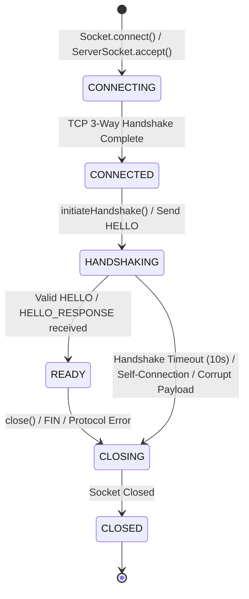

# MeshDrop Node Identity & Peer Handshake Specification

## 1. Why Node Identity Exists
In a peer-to-peer network, devices connect over arbitrary IP addresses and ephemeral ports.
An IP address or TCP port identifies a network endpoint, but **not** a persistent node instance. Multiple nodes may run on the same physical host, behind a shared NAT router, or change IP addresses when switching networks (e.g. Wi-Fi roaming).

MeshDrop solves this by assigning every node a unique, immutable **Node ID** (`java.util.UUID`) and a human-readable **Display Name**.

> [!IMPORTANT]
> **Identity vs Authentication**:
> This phase establishes **Node Identity** (who the peer claims to be). It does **not** provide cryptographic authentication (which will be added in future security phases via public keys / signatures).

---

## 2. NodeIdentity Binary Structure

The `NodeIdentity` wire layout is used as the payload for both `HELLO` and `HELLO_RESPONSE` packets:

```text
+-----------------------------------------------------------+
| NODE ID (16 bytes)                                        |  (UUID: 8 bytes mostSigBits, 8 bytes leastSigBits)
+-----------------------------------------------------------+
| NAME LENGTH (2 bytes)                                     |  (Big-Endian uint16: 0 to 128 bytes)
+-----------------------------------------------------------+
| DISPLAY NAME (N bytes)                                    |  (UTF-8 encoded string)
+-----------------------------------------------------------+
```

- **UUID Representation**: Encoded as exactly 16 big-endian bytes (2 x 64-bit longs). No string representations (`UUID.toString()`) are transmitted on the wire.
- **Display Name Limit**: Maximum 128 UTF-8 bytes (`ProtocolConstants.MAX_DISPLAY_NAME_BYTES`). Remote input exceeding this limit is rejected with a `ProtocolException` before string decoding.

---

## 3. Handshake Lifecycle & State Machine



### State Transitions:
1. **`CONNECTING`**: Socket is attempting to connect to remote host/port.
2. **`CONNECTED`**: TCP connection established. I/O streams are ready.
3. **`HANDSHAKING`**: Initial `HELLO` packet transmitted. Waiting for peer exchange.
4. **`READY`**: Mutual identity exchange completed successfully. Full application messaging (`MESSAGE`, `PING`, `FILE_*`) enabled.
5. **`CLOSING`**: Connection teardown in progress.
6. **`CLOSED`**: Terminal state. No further I/O allowed. Illegal transitions (e.g. `CLOSED -> READY`) throw `IllegalStateException`.

---

## 4. Handshake Protocol Exchange

```text
Node A (Initiator)                             Node B (Receiver)
       │                                              │
       │────────────── TCP CONNECT ──────────────────►│
       │                                              │
       │ [HANDSHAKING]                                │ [HANDSHAKING]
       │────────────── HELLO (Identity A) ───────────►│
       │                                              │ (Validates A, sets READY)
       │◄───────────── HELLO_RESPONSE (Identity B) ───│
       │ (Validates B, sets READY)                    │
       │                                              │
       │ [READY]                                      │ [READY]
       │◄═════════════ BIDIRECTIONAL P2P ════════════►│
```

### Handshake Rules:
1. **Pre-READY Restrictions**: Only `HELLO` and `HELLO_RESPONSE` packets are accepted before reaching `READY`. Any application packet (e.g. `MESSAGE`) received before `READY` causes immediate connection termination.
2. **Request-Response Correlation**: `HELLO_RESPONSE` echoes the `requestId` from the initiator's `HELLO` packet.
3. **Self-Connection Prevention**: If a received `NodeIdentity` contains the local node's own `nodeId`, the connection is detected as a self-connection, logged, and immediately closed without crashing the node.
4. **Simultaneous Connections**: If Node A and Node B initiate connections to each other concurrently, both independent TCP connections complete their handshakes without deadlock.
5. **Handshake Timeout**: Connections that fail to complete a handshake within 10 seconds (`NodeConfig.handshakeTimeoutMillis`) are automatically closed to prevent socket descriptor exhaustion.
