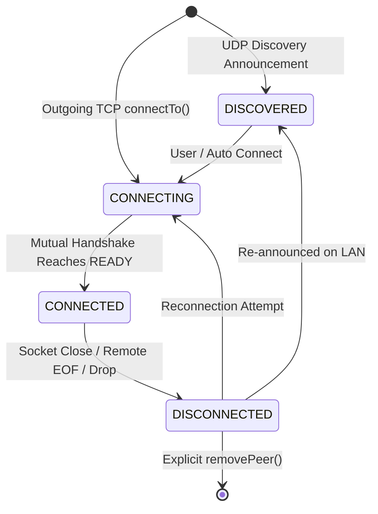

# MeshDrop Peer Management Specification

## 1. Overview: Connection vs Peer Distinction
In MeshDrop, there is a fundamental distinction between the transport layer and the peer domain model:

- **`TcpConnection` (Transport Stream)**:
  - Represents a raw bidirectional byte-stream socket connection (`java.net.Socket`).
  - Has transport-level states: `CONNECTING` → `CONNECTED` → `HANDSHAKING` → `READY` → `CLOSING` → `CLOSED`.
  - Is ephemeral: when a network cable is unplugged or a connection is reset, the `TcpConnection` instance terminates.
- **`Peer` (Mesh Member)**:
  - Represents a known remote MeshDrop node in the mesh network.
  - Has peer relationship lifecycle states: `DISCOVERED` → `CONNECTING` → `CONNECTED` → `DISCONNECTED`.
  - Is durable: even when disconnected, the `Peer` object is preserved with its `NodeIdentity` (UUID + Display Name), last known `PeerAddress`, and session history for future reconnection.

```text
+--------------------------------------------------------------------+
|                               Node                                 |
|                                                                    |
|    +--------------------+                 +-------------------+    |
|    |     TcpServer      |                 |    PeerManager    |    |
|    +---------+----------+                 +---------+---------+    |
|              |                                      |              |
|              v                                      v              |
|        TcpConnection                               Peer            |
|       (Transport Stream)                    (Mesh Member)          |
|    - State: READY                        - State: CONNECTED        |
|    - Socket / Streams                    - NodeIdentity (UUID)     |
|    - Packet Framing                      - PeerAddress (IP/Port)   |
|                                          - Active TcpConnection    |
+--------------------------------------------------------------------+
```

---

## 2. Peer Identity vs Address

```text
Identity (Authoritative & Permanent):
    NodeIdentity
      ├── UUID nodeId            (e.g. 521b0ebe-ea80-4d4b-bf9e-2501acc2e7c0)
      └── String displayName     (e.g. "Alice-Laptop")

Address (Dynamic & Volatile):
    PeerAddress
      ├── String host            (e.g. "192.168.1.100")
      └── int tcpPort            (e.g. 5000)
```

- **UUID Authority**: Two peers may share identical display names, but their 128-bit UUID is unique and authoritative.
- **Address Roaming**: As mobile nodes switch Wi-Fi networks or change DHCP leases, their `PeerAddress` updates while their `NodeIdentity` remains constant.

---

## 3. Peer State Machine



### States:
1. **`DISCOVERED`**: Peer was announced on the local network (e.g. via UDP multicast discovery), but no active TCP connection exists.
2. **`CONNECTING`**: TCP connection or protocol handshake is in progress.
3. **`CONNECTED`**: Peer completed application handshake (`READY`) and has an active transport stream.
4. **`DISCONNECTED`**: Transport connection closed. Peer identity and address retained for future reconnects.

### Discovery vs Connection Principle:
- **`Discovery != Connection`**: Discovering a peer over UDP announces its existence and advertises its TCP port, transitioning the peer to `DISCOVERED`. It does **not** automatically establish a TCP socket or grant cryptographic trust.
- **State Invariance**: A discovery beacon arriving for a peer in `CONNECTED` state will update its `lastSeen` timestamp and address without downgrading its state.
- **`lastSeen` Tracking**: Tracks `Instant` of latest network activity (discovery beacon or TCP packet), enabling future peer liveness and staleness checks.

---

## 4. Connection Lifecycle Flows

### 4.1 Incoming Connection Flow
```text
ServerSocket.accept()
    ↓
new TcpConnection(socket, INBOUND)
    ↓
HandshakeService.initiateHandshake()
    ↓
Mutual HELLO & HELLO_RESPONSE Exchanged
    ↓
Connection reaches ConnectionState.READY
    ↓
Node.onPeerHandshakeCompleted()
    ↓
PeerManager.registerConnected(remoteIdentity, address, connection)
    ↓
Peer transitioned to PeerState.CONNECTED
```

### 4.2 Outgoing Connection Flow (Automatic via Discovery / Programmatic)
```text
Peer enters DISCOVERED in PeerManager (via DiscoveryService)
    ↓
ConnectionManager.tryConnect(peer)
    ↓
Peer transitioned to PeerState.CONNECTING
    ↓
Virtual Thread: TcpConnection.connectTo(host, port, timeout) [OUTBOUND]
    ↓
HandshakeService.initiateHandshake()
    ↓
Mutual HELLO & HELLO_RESPONSE Exchanged
    ↓
Connection reaches ConnectionState.READY
    ↓
ConnectionManager.verifyOutboundIdentity(connection, remoteIdentity)
    ↓
PeerManager.registerConnected(remoteIdentity, address, connection)
    ↓
Peer transitioned to PeerState.CONNECTED
```

---

## 5. Deterministic Duplicate Connection Policy

When Node A and Node B initiate simultaneous connections to each other, two separate TCP sockets ($A \to B$ and $B \to A$) may both successfully complete the handshake.

To prevent duplicate transport streams and state divergence, `PeerManager` enforces a **symmetric, deterministic resolution policy**:

### Rule:
1. Compare local node UUID ($U_{local}$) against remote peer UUID ($U_{remote}$) using **unsigned 128-bit lexicographical comparison**.
2. **If $U_{local} < U_{remote}$**:
   - The node with the smaller UUID (Local) keeps its **`OUTBOUND`** connection.
   - The corresponding **`INBOUND`** connection is rejected and closed cleanly.
3. **If $U_{local} > U_{remote}$**:
   - The node with the larger UUID (Local) keeps its **`INBOUND`** connection (initiated by the smaller remote node).
   - Its own **`OUTBOUND`** connection is rejected and closed cleanly.

### Outcome:
Both nodes independently compute the identical outcome:
- Exactly **one** active TCP connection remains attached to the `Peer`.
- The redundant connection is closed cleanly without deadlocks or race conditions.
